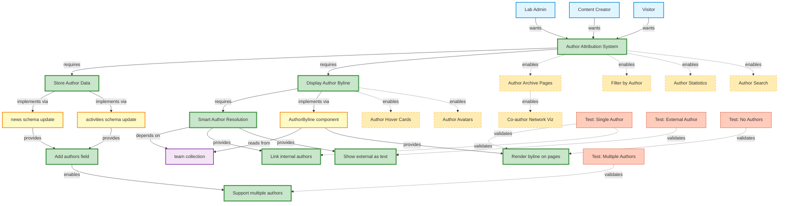

# MVP Scoping with Knowledge Graphs: Author Attribution Feature

## Why Knowledge Graphs Help with MVP Decisions

Knowledge graphs make MVP scoping visual and systematic by:
1. **Showing dependency chains** - What must be built first
2. **Identifying core vs. peripheral features** - What has the most incoming edges
3. **Revealing optional branches** - Features with no dependents
4. **Highlighting blockers** - Critical path nodes
5. **Separating concerns** - What can be deferred without breaking core value

## Author Attribution Feature Graph



## Graph Analysis for MVP Scoping

### 1. Critical Path (MVP Core)

Following the dependency chain from actors to basic functionality:

```
Actors → F1 (Attribution System) → F2 (Store Data) → C1/C2 (Schema)
                                 → F3 (Display) → C3 (Component) → R2 (Render)
                                              → F4 (Resolution) → C4 (Team) → R3/R4
```

**MVP Decision:** Everything in this path is REQUIRED for basic functionality.

### 2. Node Centrality (Importance)

Nodes with most incoming/outgoing edges are most critical:

| Node | Incoming Edges | Outgoing Edges | MVP Priority |
|------|----------------|----------------|--------------|
| F1 (Attribution System) | 3 actors | 6+ features | ⭐⭐⭐ CORE |
| C3 (AuthorByline) | 1 | 4 | ⭐⭐⭐ CORE |
| C4 (team collection) | 2 | 0 | ⭐⭐⭐ DEPENDENCY |
| F4 (Smart Resolution) | 1 | 2 | ⭐⭐⭐ CORE |
| E1 (Archive Pages) | 1 | 1 | ⭐ FUTURE |
| E6 (Avatars) | 1 | 0 | ⭐ FUTURE |

### 3. Leaf Nodes (Deferrable)

Nodes with NO outgoing dependencies can be safely deferred:

- ✋ **Author Avatars** (E6) - Nice to have, zero dependencies
- ✋ **Author Hover Cards** (E5) - Enhancement only
- ✋ **Author Statistics** (E3) - Reporting feature
- ✋ **Co-author Network** (E7) - Advanced visualization

**MVP Decision:** EXCLUDE all leaf nodes from v1.0

### 4. Feature Clustering

Group related features to find natural release boundaries:

**Cluster 1: MVP Core (v1.0)**
```
├─ Store author data (C1, C2, R1)
├─ Display bylines (C3, R2)
├─ Smart resolution (F4, R3, R4)
└─ Multiple author support (R5)
```

**Cluster 2: Discovery Features (v1.1)**
```
├─ Filter by author (E2)
├─ Author archive pages (E1)
└─ Author search (E4)
```

**Cluster 3: Enhanced UX (v1.2)**
```
├─ Author hover cards (E5)
├─ Author avatars (E6)
└─ Author statistics (E3)
```

**Cluster 4: Advanced Analytics (v2.0)**
```
└─ Co-author network visualization (E7)
```

### 5. Enabling vs. Enabled Features

**Enabling features** (must be in MVP):
- F1: Author Attribution System - enables E1, E2, E3, E4
- F3: Display Author Byline - enables E5, E6
- F2: Store Author Data - foundation for everything

**Enabled features** (can be deferred):
- All E1-E7 are enabled BY the MVP, not enabling anything else

**MVP Decision:** Include only ENABLING features in v1.0

## MVP Definition Matrix

Using graph analysis, here's the final MVP scope:

| Feature | Graph Role | Dependencies | Dependents | MVP Status |
|---------|------------|--------------|------------|------------|
| Store author data (C1, C2) | Enabler | None | All features | ✅ MVP |
| AuthorByline component (C3) | Core | C4 (team) | Display, Future | ✅ MVP |
| Smart resolution (F4) | Core | C4 (team) | Link internal | ✅ MVP |
| Display on detail pages (R2) | Core | C3 | None | ✅ MVP |
| Link internal authors (R3) | Core | F4 | None | ✅ MVP |
| Show external as text (R4) | Core | F4 | None | ✅ MVP |
| Multiple authors (R5) | Core | R1 | None | ✅ MVP |
| Display on cards | Enhancement | C3 | None | ⚠️ v1.1 |
| Author archive pages (E1) | Leaf | F1 | E7 | ❌ v1.1 |
| Filter by author (E2) | Leaf | F1 | None | ❌ v1.1 |
| Author statistics (E3) | Leaf | F1 | None | ❌ v1.2 |
| Author search (E4) | Leaf | F1 | None | ❌ v1.1 |
| Author hover cards (E5) | Leaf | F3 | None | ❌ v1.2 |
| Author avatars (E6) | Leaf | F3 | None | ❌ v1.2 |
| Co-author network (E7) | Leaf | E1 | None | ❌ v2.0 |

## Decision Framework

### Include in MVP if:
1. ✅ **On critical path** from user need to basic value
2. ✅ **Has dependents** (other features need it)
3. ✅ **High centrality** (many connections)
4. ✅ **Enabling feature** (unlocks future work)
5. ✅ **Validates core hypothesis** (attribution is useful)

### Defer to Later if:
1. ❌ **Leaf node** (nothing depends on it)
2. ❌ **Enhancement only** (improves but doesn't enable)
3. ❌ **Low centrality** (few connections)
4. ❌ **Enabled feature** (only works after MVP)
5. ❌ **Complex/risky** (could delay MVP launch)

## MVP Implementation Order (Graph Traversal)

Following dependency order (topological sort):

```
Phase 1: Foundation (No dependencies)
├─ 1. Update news schema (C1)
├─ 2. Update activities schema (C2)
└─ 3. Verify team collection exists (C4)

Phase 2: Core Logic (Depends on Phase 1)
├─ 4. Create AuthorByline component (C3)
│   └─ Implements smart resolution (F4)
│   └─ Handles multiple authors (R5)
└─ 5. Write resolution logic

Phase 3: Integration (Depends on Phase 2)
├─ 6. Update news detail template
├─ 7. Update activities detail template
└─ 8. Update content with authors

Phase 4: Testing (Validates everything)
├─ 9. Test single author (T1)
├─ 10. Test multiple authors (T2)
├─ 11. Test external author (T3)
└─ 12. Test no authors (T4)
```

## Risk Analysis via Graph

### Single Point of Failure Nodes

Nodes that, if they fail, break everything:

1. **C4 (team collection)** - If broken, author linking fails
   - **Mitigation:** Graceful fallback to plain text
   - **Risk:** LOW (existing, stable component)

2. **C3 (AuthorByline component)** - If broken, no display
   - **Mitigation:** Make optional in templates
   - **Risk:** MEDIUM (new code)

3. **Schema changes (C1, C2)** - If broken, data loss
   - **Mitigation:** Optional field, backward compatible
   - **Risk:** LOW (simple addition)

### Scope Creep Vectors

Edges pointing to future features are tempting scope creep:

```
F1 --enables--> E1 (Archive Pages)  ⚠️ "While we're at it..."
F1 --enables--> E2 (Filtering)      ⚠️ "Just a quick filter..."
F3 --enables--> E6 (Avatars)        ⚠️ "Looks better with photos..."
```

**Protection:** The graph makes it visible when you're leaving MVP territory.

## Success Metrics by Graph Layer

**MVP Layer (v1.0):**
- ✅ All news/activities can have authors
- ✅ Authors display correctly on pages
- ✅ Internal authors link to profiles
- ✅ No errors with missing authors

**Enhancement Layer (v1.1):**
- 📊 % of articles with authors filled in
- 📊 Click-through rate on author links
- 📊 Archive page views

**Advanced Layer (v1.2+):**
- 📊 Search usage with author filters
- 📊 Engagement with network visualizations

## Using the Graph in Planning Meetings

### Scenario 1: "Can we add author photos?"

**Graph Answer:**
1. Find E6 (Author Avatars) node
2. Check dependencies: Requires F3 (Display) ✅ in MVP
3. Check dependents: Zero ❌ nothing needs it
4. Check layer: Enhancement Layer

**Decision:** Defer to v1.2, it's a leaf node

### Scenario 2: "Should we support guest authors?"

**Graph Answer:**
1. Check F4 (Smart Resolution) - already handles external names
2. R4 (Show external as text) - already in MVP
3. No new nodes needed

**Decision:** Already supported! No scope change.

### Scenario 3: "What if we skip multiple author support?"

**Graph Answer:**
1. Find R5 (Multiple authors)
2. Check dependents: E7 (Network viz) uses it
3. Check incoming: R1 (Add authors field) enables it
4. Impact: Breaks array structure, affects future features

**Decision:** Keep it - low effort, high future value

## Graph Evolution Over Time

### v1.0 Launch
```
[MVP Core nodes] = SHIPPED ✅
[Future nodes] = DEFERRED ⏳
```

### v1.1 Planning
```
[MVP Core] = STABLE 🔒
[E1, E2, E4] = NOW IN DEVELOPMENT 🚧
[E3, E5, E6, E7] = STILL DEFERRED ⏳
```

### v1.2 Planning
```
[MVP Core + E1, E2, E4] = STABLE 🔒
[E3, E5, E6] = NOW IN DEVELOPMENT 🚧
[E7] = BLOCKED ON E1 ⛔
```

## Visualization Benefits

A knowledge graph makes these questions trivial to answer:

1. **"What's in MVP?"** → Highlight green nodes
2. **"What's blocked?"** → Find nodes with unmet dependencies (red incoming edges)
3. **"What can we defer?"** → Find leaf nodes with dashed edges
4. **"What's the critical path?"** → Find longest path from actor to value
5. **"What breaks if we change X?"** → Traverse outgoing edges from X
6. **"What's the implementation order?"** → Topological sort of dependency graph
7. **"What's the risk?"** → Identify single-point-of-failure nodes (high centrality)

## Tools for This Approach

### For Documentation (Now)
- **Mermaid** - Renders in GitHub/Markdown ✅ Used above
- **GraphViz** - Classic graph visualization
- **Excalidraw** - Manual drawing with clarity

### For Active Development
- **Neo4j** - Query and explore interactively
- **Obsidian** - Link notes, view graph
- **Notion** - Linked databases with views

### For Product Management
- **Linear** - Issues with dependencies
- **Jira** - Epic/story hierarchy
- **Monday.com** - Visual dependency tracking

## Next Steps

1. ✅ Create knowledge graph (done above)
2. Review with team - discuss MVP boundary
3. Get consensus on v1.0 scope
4. Use graph to create implementation tickets
5. Update graph as you learn/change scope
6. Review graph before each release

## Recommendation for Author Attribution

Based on graph analysis, the **MVP (v1.0)** should include:

**In Scope:**
- ✅ Schema updates (C1, C2)
- ✅ AuthorByline component (C3)
- ✅ Smart resolution logic (F4)
- ✅ Display on detail pages (R2)
- ✅ All 4 test cases (T1-T4)
- ✅ Update 10 new articles with authors

**Out of Scope (defer to v1.1+):**
- ❌ Author archive pages
- ❌ Filtering by author
- ❌ Author search
- ❌ Author statistics
- ❌ Hover cards
- ❌ Avatars
- ❌ Display on listing cards (maybe - discuss)

**Estimated Effort:**
- MVP: 3-4 hours
- v1.1: 4-6 hours
- v1.2: 3-4 hours

**Ship MVP first, validate with real usage, then enhance based on data.**
